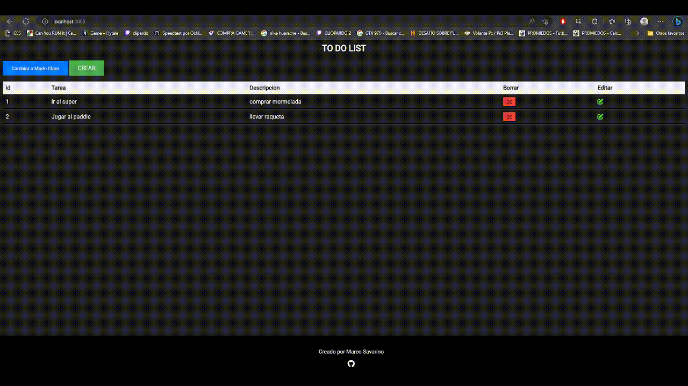

### 📝 TO DO LIST(NodeJs)

### Descripción del Proyecto

El proyecto de Lista de Tareas es una aplicación web 📝 que utiliza Node.js y Express Generator como marco de desarrollo, siguiendo el patrón Modelo-Vista-Controlador (MVC). La aplicación permite a los usuarios crear, editar y eliminar tareas en una lista, utilizando rutas parametrizadas para manejar las diferentes operaciones.

### Tecnologías Utilizadas

El proyecto utiliza las siguientes tecnologías:

- **Node.js**: Una plataforma de JavaScript que permite ejecutar código JavaScript en el servidor. Se utiliza para crear el backend de la aplicación, gestionar las rutas y controlar la lógica de negocio.

- **Express Generator**: Un generador de aplicaciones web basadas en Express, que proporciona una estructura de directorios y archivos predefinida para desarrollar rápidamente aplicaciones web en Node.js. Se utiliza para generar la estructura básica del proyecto y configurar el servidor Express.

- **Modelo-Vista-Controlador (MVC)**: Un patrón de diseño de software que separa la aplicación en tres componentes principales: el modelo que representa los datos y la lógica de negocio, la vista que muestra los datos al usuario y el controlador que maneja las interacciones del usuario con la aplicación. Se utiliza para organizar y modularizar el código del proyecto.

- **Rutas Parametrizadas**: Se utilizan para manejar diferentes operaciones en la aplicación, como la creación, edición y eliminación de tareas, utilizando parámetros en la URL para identificar las operaciones a realizar.

- **EJS**: Un motor de plantillas para Node.js que permite generar vistas dinámicas en HTML, utilizando código JavaScript. Se utiliza para renderizar las vistas en el servidor y mostrar la interfaz de usuario al usuario.

- **CSS y JavaScript para Frontend**: Se utilizan para dar estilo y funcionalidad a la interfaz de usuario de la aplicación, permitiendo una experiencia de usuario agradable y interactiva.

### Funcionalidades Principales

El proyecto de Lista de Tareas incluye las siguientes funcionalidades principales:

- Creación de Tareas: Los usuarios pueden crear nuevas tareas proporcionando un título y una descripción.

- Edición de Tareas: Los usuarios pueden editar el título y la descripción de las tareas existentes.

- Eliminación de Tareas: Los usuarios pueden eliminar tareas que ya no deseen.

- Listado de Tareas: Los usuarios pueden ver todas las tareas existentes en una lista ordenada.

- Rutas Parametrizadas: Se utilizan rutas parametrizadas para manejar las diferentes operaciones en las tareas, permitiendo una gestión eficiente de las mismas.

### Conclusiones

El proyecto de Lista de Tareas utilizando Node.js, Express Generator, Modelo-Vista-Controlador, Rutas Parametrizadas, EJS, CSS y JavaScript para frontend, ofrece una solución completa y eficiente para la gestión de tareas en una aplicación web. Con su estructura modularizada y su enfoque en las mejores prácticas de desarrollo web, este proyecto es una excelente opción para aquellos que deseen desarrollar una aplicación de Lista de Tareas robusta y escalable utilizando tecnologías modernas de desarrollo web.
